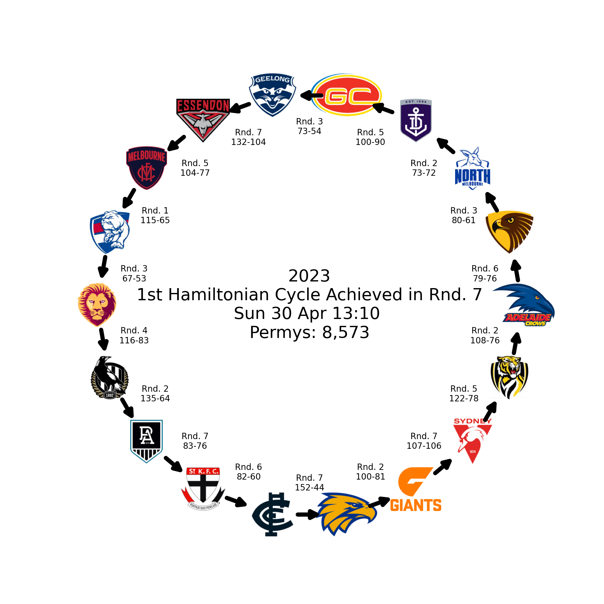

# Hamiltonian Sports  

<!-- BADGES/ -->

  

  
<!-- TODO test coverage badges -->

The purpose of this repo is to search-for and detect the first occurence of a hamiltonian cycles in a sports league season. A [hamiltonian cycle](https://en.wikipedia.org/wiki/Hamiltonian_path) occurs when an undirected [graph](https://en.wikipedia.org/wiki/Graph_(abstract_data_type)) visits each node exactly once. For this use-case, a sports league hamiltonian graph is constructed based on victories, and a hamiltonian cycle is defined when game winner-loser relationships can be travesed in a manner that includes every team in that league exactly once, starting and finishing with the same team. The illustration below helps explain the concept using three teams.

---
| Team | Won against |  
| :- | :- |  
| Morwell | Moe, Traralgon |  
| Moe | Traralgon |  
| Traralgon | Morwell, Moe |  

Morwell has defeated Moe and Traralgon. Moe has defeated Traralgon. Traralgon has defeated Morwell and Moe. Using this simple example, we can make a hamiltonian cycle from Morwell >> Moe >> Traralgon >> Morwell. The above table is also a good demonstration of an adjacency graph, a neat data structure which helps define graph structure neatly (in this case, unweighted and undirected graph structure).  

The purpose of this exercise is to see when 'parity' first occured during a sports season, just for fun.  

### Sports Leagues  

Currently only AFL (Australian Football League) is set up to run with this code so far. This [API](https://api.squiggle.com.au/) has been kindly built by [Squiggle](https://squiggle.com.au/) for hobbiest use, so treat it nicely like a good community should. Please respect the [How to be nice](https://api.squiggle.com.au/#section_bots) rules.  
  
Might introduce other leagues in the future (with a strong preference to free APIs...), have designed this code using a simple factory pattern to help ease any future enhancements.  
  
If you don't care about how the code works and just want to run it for yourself you can skip down to the [How to run](#how-to-run) section.  

## Process  

1. Validate command line arguments  
1. Download and parse data from the pre-configured API  
1. Sequentially by round, search for a hamiltonian cycle  
1. If a hamiltonian cycle is found, draw and infographic  
1. Output search results to json doc  

Using command line arguments, the code will know which league and season to extract from the pre-configured API, parse the data and structure it for consumption by the algorithm. Should a hamiltonian cycle be found, an infographic will be generated with details of the cycle, and some extra details like permutations undertaken and individual game results making up the cycle.  

### Algorithms  

The graph traversal algorithm [depth-first search](https://en.wikipedia.org/wiki/Graph_traversal#Graph_traversal_algorithms) was used for this since it is more suited to hamiltonian cycles, due to backtracking which allows for less memory consumption. The alternative, [breadth-first search](https://en.wikipedia.org/wiki/Graph_traversal#Breadth-first_search), is more suited to finding shortest-path graph traversal, and due to the algorithmn having to store partially explored paths in memory, is susceptible to memory problems.  

As mentioned above, the graph itself is stored as an adjacency list, allowing for efficient and easy management. Algorithm complexity is generally decribed in [Big O](https://github.com/elijahsimpsonn/DSA-Big-O) notation, most commonly for Time Complexity and Space Complexity.

#### Big O Complexity  

Both DFS and BFS share the same time and space complexity **_O(V+E)_**, where **_V_** is the number of vertices, in our case sports teams, and **_E_** is the number of edges, in our case victories. This indicates the worst-case of search, all vertices _and_ nodes will need to be traversed. The space complexity is considered **_O(V)_** since all the vertices (teams) will be considered in the search.  
  
As a hamiltonian cycle is a specific outcome being sought, the complexity increases. Even when taking advantage of the backtracking method, the time complexity is **_O(V!)_** as each traversal must consider all the other vertices not yet visited in the current traversal, and the worst case is that all vertices must be visited from each other vertice. Space complexity remains a constant **_O(1)_**, as a single path is considered at any one time, which is backtracked when it is not traversable any further.  

The number of permutations undertaken in each seasons search is recorded in the output, just for interest.  

### Code  

Utilises a basic factory design pattern, with the `APICreator` class in `./src/api/creator` able to process various contcrete APIs classes.  
  
#### Extending  

Only the AFL concrete class has (so far) been created, but this can be used a template for integrating other sports results APIs, just needing to ensure the API data is parsed into the pydantic model classes in `./src/api/models.py` in the new concrete class, then the creator and client will be able to search them for hamiltonian cycles without any further work being required. `APICreator` is an instance of an abstract class, which provides universal methods for extracting, downloading, caching API response data, thus only a new concrete class needs be generated, along with providing syntax and accepted values for the command line arguments and config, found in `./utils/`.  

As always, remember your pytests and be nice to your API provider.  
  
## How to run  

The script is called using two mandatory command line arguments, and one optional.  

| Switch | Description | Example Argument |
|:-|:-|:-|
|-l| League _string_, the sport league to be searched | afl |
|-s| Season _string_, the season to be searched | 2023 |
|-c| Clear Cache, _bool_, purged cached API response data for that league/season | (switch only)|

For example, running `python -m hamiltoniansports -l afl -s 2023` will run the hamiltonian cycle search for AFL, in Season 2023.  
  
_Note:_ for AFL, the `Config` class in `./utils/config.py` requires that you update your email address here so that you satisfy [Squiggle](https://api.squiggle.com.au/#section_bots) appropriately.  

Logs are found in `./.logs/`, with search file being the local datetime that particular run was triggered.  
  
Docker is the better method for running, however instructions are included below for running either in Docker or locally.  

### Docker  

Docker has been set up to start a container to run the code, and another to run the tests. The output of the tests container should be checked before running the code.  

Build the images and start the container in the background  
`docker compose up --build -d`  

#### Tests Container  

Use `docker compose logs hamiltoniansports-test` to see the log output of the test container. Any errors will be obvious, but (without any modification) can expect all the tests to be passing.  
  
_Ensure all code modifications are tested and new functionality has new tests created for coverage._  

#### Code Container  

Enter the container it using `docker exec -it hamiltonian-sports-hamiltoniansports-1 bash` command.  
  
Running the command `python -m hamiltoniansports -l afl -s 2023`  
for example will run the code for afl in season 2023.

If you want to run for a range of seasons, can easily use the bash command:  
`for cur_season in {1897..2023}; do python -m hamiltoniansports -l afl -s "$cur_season"; done`  
Modifying the command (or creating a bespoke bash script) for whichever league/range of seasons wanted.  

Use `docker stop hamiltoniansports-hamiltoniansports-1` when done to stop the container running. It can be started again later `docker start hamiltoniansports-hamiltoniansports-1`.  

### Locally

1. Install python 3.10.12  
1. Build a virutal environment `python -m venv .venv` (maybe python3 depending on local setup)  
1. Activate the virtual env (varies depending on OS, see [docs](https://docs.python.org/3/library/venv.html) for guidance)  
1. Run the tests prior to any run `python -m pytest ./tests` (alter ./tests to match syntax of your OS). Address any test result failures.
1. Run the command `python -m hamiltoniansports -l afl -s 2023` (for example) will run the code for afl in season 2023.
1. Repeat previous step for other seasons, or build a loop to run seasons sequentially. 

## Output

Results from the code are stored in `/data/<league>/<season>/`, which contain cached API responses and a basic infographic of the resulting hamiltonian cycle (if one is found). Remember that team logos are copyright of whatever respective league they are from or whatever, am doing this as a fun coding exercise for zero profit so just be nice. There's a handful of examples run for AFL in `/sample_output/<season>/`, containing seasons with and without hamiltonian cycles found.  

In the `<league>` dir, a single json doc `all_seasons.json` contains details of the hamiltonian cycle search and resulting hamiltonian cycle. This file has been included in `/sample_output/` for AFL.  

For each season (the _key_ in the json doc), the following attributes are provided in `all_seasons.json`:  
| Attribute | Description |
|:-|:-|
| Has_HC | Boolean flag whether a hamiltonian cycle was found in that season |
| HC | First hamiltonian cycle found for that season, based on team ids |
| HC_Team_Names | As above, but with team names |
| HC_Round | Season round that the first hamiltonian cycle was found |
| HC_Date | Datetime (local, but may depend on the API structure and detail) of last game that created the first hamiltonian cycle |
| Permutations | Count of permutations the algorithm undertook during the search |
| Permutation Progression | List of cumulative count of permuatations, by round |
| Algo_Runtime_s | Algorithm Runtime in seconds |
| Algo_Runtime_m | Algorithm Runtime in minutes |
| Total_HC | Count of hamiltonian cycles found for that season, up until the round where the first one was found |

  
  
*Example Infographic for AFL Season 2023*  
  
## Analysis  
  
Might do some basic analysis as a github page on this later, will provide hyperlink then.  
  
## Known Issues and Future Work  

* Built on a single API so far, using data structure / assumptions based on that one only hence ease of extensibility not fully known.  Assume API also contains things like team details / logos etc...
* Factory pattern requires better output and structure expectation explainers. Code structure could be cleaner.  
* UML Diagrams of code.  
* Fix nested 'patch' design in pytests, not a fan of how black reformats these - make it neater  
* Extend with other sports APIs in the future.  
* Include option(s) to use different algorithms (for analysis comparisons).  
* Options for parallel computing?  
  * BFS/DFS: split each 1-2 path of onto separate CPUs etc...  
  
